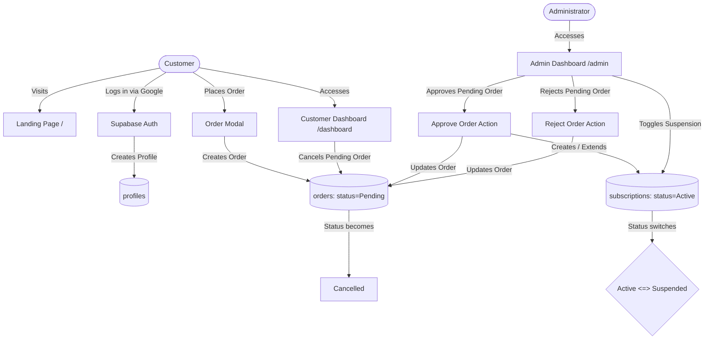

# AI Store — متجر الذكاء الاصطناعي

A full-stack Arabic subscription e-commerce platform for AI products and services. Built with React 19, TypeScript, Vite, and Supabase.

---

## ✨ Features

### Customer-Facing
- **Landing Page** — Animated hero, stats counter, pricing packages, testimonials carousel, and FAQ accordion
- **Google OAuth** — One-click sign-in via Supabase Auth
- **Order Modal** — Multi-step checkout flow with inline error handling and automatic redirect to dashboard on success
- **Customer Dashboard** — View active/expired/suspended subscriptions, pending orders, and profile info
- **Cancel Pending Orders** — Inline confirmation toggle (no blocking browser dialogs)
- **Renewal Requests** — Available exclusively for expired subscriptions
- **Dark / Light Theme** — System-aware toggle with smooth transitions
- **Scroll Progress Button** — Bottom-left floating indicator
- **Privacy & Terms pages**

### Admin Panel (`/admin`)
- **Users tab** — View all registered users and their profiles
- **Orders tab** — Approve or reject pending orders; add private notes; activate subscriptions on approval
- **Subscriptions tab** — View all subscriptions with status badges; **suspend / unsuspend** active subscriptions via toggle button
- **Products tab** — Manage AI product catalog
- **Plans tab** — Manage pricing plans per product

---

## 🛠 Tech Stack

| Layer | Technology |
|---|---|
| Framework | React 19 + TypeScript |
| Build Tool | Vite 8 |
| Styling | Vanilla CSS (custom design system) + Tailwind CSS 4 |
| Icons | Lucide React |
| Routing | React Router DOM v7 |
| Backend / DB | Supabase (PostgreSQL + Auth + RLS) |
| Linting | Oxlint |
| Package Manager | pnpm |

---

## 📊 System Architecture & Data Flow



---

## 📁 Project Structure

```
ai-store/
├── src/
│   ├── components/
│   │   ├── FAQAccordion.tsx           # Collapsible FAQ section
│   │   ├── IntroScreen.tsx            # Animated intro/splash screen
│   │   ├── OrderModal.tsx             # Multi-step checkout modal
│   │   ├── ProfileCompletionModal.tsx # Post-login profile form
│   │   ├── ScrollProgressButton.tsx   # Floating scroll-to-top button
│   │   ├── StatsCounter.tsx           # Animated statistics
│   │   ├── TestimonialsCarousel.tsx   # Customer testimonials
│   │   └── ThemeToggle.tsx            # Dark/light theme switcher
│   ├── context/
│   │   └── AuthContext.tsx            # Auth state, Google OAuth, profile sync
│   ├── lib/
│   │   └── supabase.ts                # Supabase client instance
│   ├── pages/
│   │   ├── Admin.tsx                  # Admin dashboard (users/orders/subs/products/plans)
│   │   ├── Dashboard.tsx              # Customer dashboard
│   │   ├── Home.tsx                   # Public landing page
│   │   ├── Privacy.tsx                # Privacy policy page
│   │   └── Terms.tsx                  # Terms of service page
│   ├── App.tsx                        # Router + ProtectedRoute + AdminRoute guards
│   └── main.tsx                       # React entry point
├── supabase/
│   ├── migrations/
│   │   ├── 001_initial_schema.sql     # Tables: profiles, products, plans, orders, subscriptions
│   │   ├── 002_rls.sql                # Row-Level Security policies
│   │   ├── 003_seed.sql               # Initial plans and product seed data
│   │   ├── 004_indexes.sql            # Performance indexes
│   │   ├── 005_add_notes_to_orders.sql   # Adds notes column to orders
│   │   ├── 006_users_cancel_orders.sql   # RLS: users can cancel own pending orders
│   │   └── 007_add_suspended_to_subscription_status.sql  # Adds Suspended status
│   └── reset_database.sql             # Full DB teardown + rebuild script
├── index.html
├── vite.config.ts
├── tsconfig.json
└── package.json
```

---

## 🗄 Database Schema

### Tables

| Table | Description |
|---|---|
| `profiles` | User info (name, phone, `is_admin` flag) synced from Auth |
| `products` | AI products for sale |
| `plans` | Pricing plans per product (duration, price, badge) |
| `orders` | Customer orders — status: `Pending`, `Approved`, `Rejected`, `Cancelled` |
| `subscriptions` | Active entitlements — status: `Active`, `Expired`, `Cancelled`, `Suspended` |

### Security
- **Row-Level Security (RLS)** is enabled on all tables
- Users can only read/update their own data
- Users may cancel their own `Pending` orders (status → `Cancelled`)
- Admins have unrestricted access via `is_admin` profile flag

---

## 🚀 Getting Started

### Prerequisites
- Node.js ≥ 20
- pnpm
- A [Supabase](https://supabase.com) project

### 1. Clone & Install

```bash
git clone https://github.com/your-org/ai-store.git
cd ai-store
pnpm install
```

### 2. Configure Environment

Create a `.env.local` file in the project root:

```env
VITE_SUPABASE_URL=https://your-project.supabase.co
VITE_SUPABASE_ANON_KEY=your-anon-key
```

### 3. Set Up the Database

Run the migrations in order inside the **Supabase SQL Editor**:

```
supabase/migrations/001_initial_schema.sql
supabase/migrations/002_rls.sql
supabase/migrations/003_seed.sql
supabase/migrations/004_indexes.sql
supabase/migrations/005_add_notes_to_orders.sql
supabase/migrations/006_users_cancel_orders.sql
supabase/migrations/007_add_suspended_to_subscription_status.sql
```

> To reset and rebuild the entire database from scratch, run `supabase/reset_database.sql`.

### 4. Run the Dev Server

```bash
pnpm dev
```

App is available at `http://localhost:5173`.

---

## 📜 Available Scripts

| Script | Description |
|---|---|
| `pnpm dev` | Start local development server with HMR |
| `pnpm build` | Type-check and build for production |
| `pnpm preview` | Preview the production build locally |
| `pnpm lint` | Run Oxlint static analysis |

---

## 🔐 Route Guards

| Route | Guard | Behavior |
|---|---|---|
| `/` | None | Public landing page |
| `/dashboard` | `ProtectedRoute` | Redirects to `/` if unauthenticated; redirects to `/admin` if user is admin |
| `/admin` | `AdminRoute` | Redirects to `/` if unauthenticated; redirects to `/dashboard` if not admin |
| `/privacy`, `/terms` | None | Public static pages |
| `*` | Catchall | Redirects to `/` |

> **Local development bypass**: Route guards are skipped on `localhost` / `127.0.0.1` to speed up development.

---

## 🌐 RTL & Arabic Support

The UI is built entirely in Arabic (RTL layout). The `dir="rtl"` attribute is set on the root HTML element and all layout utilities respect right-to-left reading direction.
